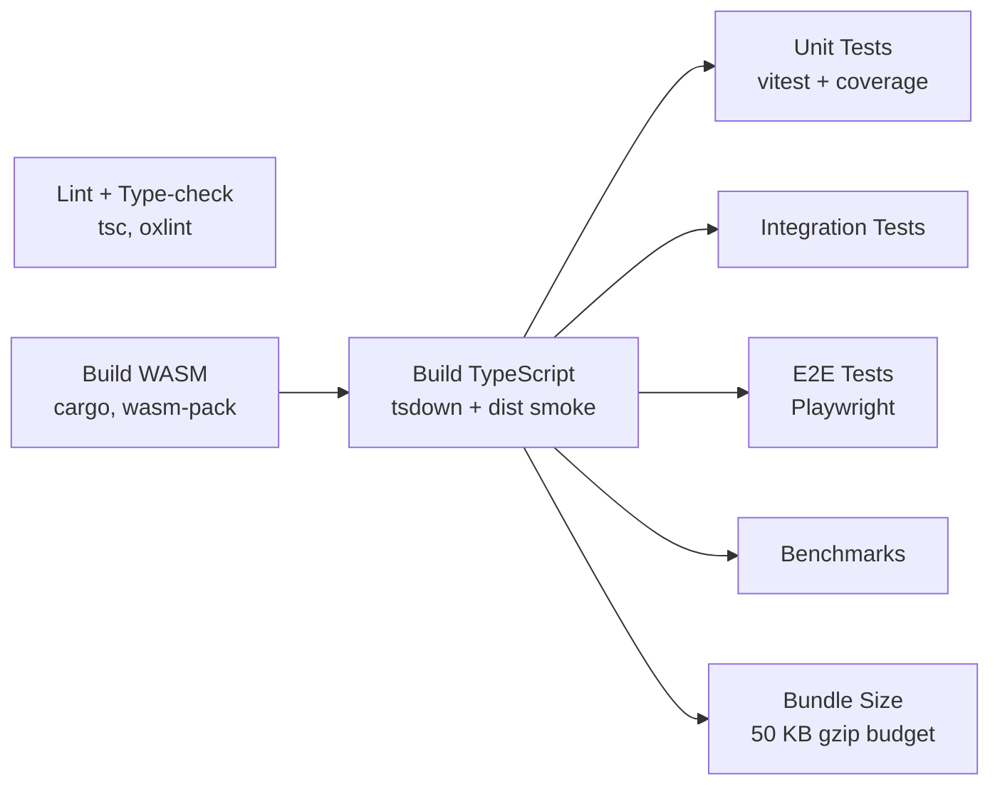

# Contributing to modern-pdf-lib

Thanks for your interest in contributing. This guide gets you from a clean clone
to a green pull request.

modern-pdf-lib is a **hybrid TypeScript + Rust/WASM** package: the engine is
TypeScript, and six optional Rust crates compile to WebAssembly for hot paths.
You can contribute to the TypeScript side without installing Rust — the library
has a pure-JS fallback for every WASM path.

---

## Quick Start

```bash
# Fork, then clone your fork
git clone https://github.com/<your-username>/modern-pdf-lib.git
cd modern-pdf-lib

# Install dependencies
npm ci --legacy-peer-deps

# Run the test suite
npm test
```

> [!NOTE]
> Use `npm ci --legacy-peer-deps` — the same command CI runs. The project pins
> bleeding-edge exact versions (TypeScript 7, Vitest 5, Prettier 4, oxlint), and
> some of those pre-release packages advertise peer ranges that npm's strict
> resolver rejects.

### Prerequisites

| Tool | Version | Required for |
|---|---|---|
| Node.js | **>= 26.4** (`engines.node`) | Everything |
| npm | Ships with Node 26 | Dependency install, all scripts |
| Rust + `wasm32-unknown-unknown` | `beta` channel (CI pins `beta`) | Only for `src/wasm/**` changes |
| `wasm-pack` | 0.15.x | Only for `src/wasm/**` changes |
| Bash | Git Bash on Windows | `build:wasm`, `copy:wasm` (shell scripts) |

> [!TIP]
> Skip Rust entirely unless you are touching `src/wasm/`. Tests, type-checking,
> linting, and the TypeScript build all run without a WASM toolchain; the
> library falls back to pure JS and produces byte-identical PDFs.

---

## Development Workflow

1. **Branch from `master`** — use a descriptive name (`fix/png-embed-crash`,
   `feat/svg-support`).
2. **Make your change** — keep the PR focused on a single concern.
3. **Run the local gate** — the four commands below must all pass.
4. **Open a pull request** — fill out the template and link related issues.

### The local gate

Run these before pushing. They mirror the CI jobs, so a green local gate is a
green CI run.

```bash
npm run typecheck   # tsc --noEmit
npm run lint        # oxlint + tsgolint, type-aware
npm test            # vitest run — the full suite
npm run build       # tsdown + .d.ts finalize + dist smoke test
```

### All npm scripts

<details>
<summary>Full script reference</summary>

| Script | What it does |
|---|---|
| `npm run build` | `tsdown` bundle → `finalize-dts.mjs` → `smoke-dist.mjs` |
| `npm run build:wasm` | Build all six Rust crates with `wasm-pack` (release) |
| `npm run build:iife` | Build the standalone `<script>` IIFE bundle |
| `npm run build:all` | `build:wasm` → `build` → `build:iife` → `copy:wasm` |
| `npm run copy:wasm` | Copy each crate's `pkg/` output into `dist/wasm/<crate>/` |
| `npm run smoke` | Import-check the built `dist/` as both ESM and CJS |
| `npm test` | Full Vitest run |
| `npm run test:watch` | Vitest in watch mode |
| `npm run test:integration` | Only `tests/integration` |
| `npm run test:e2e` | Playwright browser E2E (`tests/e2e`) |
| `npm run bench` | Benchmark suite via the tinybench harness |
| `npm run lint` / `lint:fix` | oxlint, type-aware |
| `npm run format` / `format:check` | Prettier over `{src,tests,scripts}/**/*.ts` |
| `npm run typecheck` | `tsc --noEmit` |
| `npm run docs:dev` / `docs:build` | VitePress site |
| `npm run docs:api` | Regenerate the TypeDoc API reference + VitePress sanitizer |
| `npm run validate-pdf` | Structural validation of a generated PDF |
| `npm run clean` | Remove `dist/` and `coverage/` |

</details>

### Building the WASM crates

Only needed when you change Rust sources under `src/wasm/`.

```bash
# One-time toolchain setup
rustup target add wasm32-unknown-unknown
cargo install wasm-pack

# Build all six crates (release)
npm run build:wasm

# Faster, unoptimised build while iterating
bash scripts/build-wasm.sh --debug
```

Output lands in `src/wasm/<crate>/pkg/` (git-ignored). `npm run copy:wasm` stages
those artifacts into `dist/wasm/<crate>/` for publishing.

| Crate | Cargo package | Accelerates |
|---|---|---|
| `libdeflate` | `modern-pdf-deflate` | Stream compression (`FlateDecode`) |
| `png` | `modern-pdf-png` | PNG decoding for image embedding |
| `ttf` | `modern-pdf-ttf` | TrueType/OpenType parsing + subsetting |
| `shaping` | `modern-pdf-shaping` | Complex-script text shaping |
| `jbig2` | `modern-pdf-jbig2` | JBIG2 image decoding |
| `jpeg` | `modern-pdf-jpeg` | JPEG encode/decode |

---

## Code Style

Most of these are **enforced by tooling**, not just convention — the enforcing
rule is named so you know what will fail.

| Rule | Enforced by |
|---|---|
| No `Buffer` — use `Uint8Array` for all binary data | oxlint `no-restricted-globals: ["Buffer"]` |
| No `any` casts | oxlint `typescript/no-explicit-any: error` |
| `const` by default, `let` only when reassigned | oxlint `prefer-const: error` |
| No unused variables (prefix intentional ones with `_`) | oxlint `no-unused-vars` |
| No stray `console` calls outside `src/cli/**` | oxlint `no-console: warn` |
| TypeScript strict mode, `noUncheckedIndexedAccess`, `exactOptionalPropertyTypes` | `tsconfig.json` |
| **Explicit types on every export** (`isolatedDeclarations`) | `tsconfig.json` |
| ESM-only `import`/`export`, `verbatimModuleSyntax` | `tsconfig.json` |
| Single quotes, trailing commas, 100-col, LF endings | `.prettierrc` (`npm run format`) |

> [!IMPORTANT]
> `isolatedDeclarations: true` is the rule newcomers hit first. Every exported
> function, class member, and constant needs an explicit return/value type
> annotation — TypeScript will not infer it across the declaration boundary.
> `npm run typecheck` catches this.

The `no-restricted-globals` and `no-implied-eval` rules are relaxed in a small
set of files (the Acrobat form-script evaluator, the streaming parser, the
runtime adapters, and the CLI) via `overrides` in `.oxlintrc.json`. Do not add
new exemptions without discussion in the PR.

---

## Testing

We use [Vitest](https://vitest.dev/) for unit, integration, and compliance
tests, and [Playwright](https://playwright.dev/) for browser E2E.

When adding a feature or fixing a bug: write a test that fails before your
change and passes after, then run the full suite.

| Directory | Contents | Count |
|---|---|---|
| `tests/unit/` | Per-module unit tests mirroring `src/` | 273 files |
| `tests/layout/` | Table, header/footer, and text-layout behaviour | 11 files |
| `tests/barcode/` | Symbology encoders (QR, Code 128, EAN, PDF417, …) | 10 files |
| `tests/image/` | Image decoders and embedding | 9 files |
| `tests/browser/` | Browser-surface APIs under a simulated DOM | 8 files |
| `tests/compliance/` | PDF/A, PDF/X, PDF/UA, e-invoicing conformance | 8 files |
| `tests/integration/` | Cross-module end-to-end document flows | 4 files |
| `tests/e2e/` | Playwright specs (`*.spec.ts`) driven through Vite | 1 spec |
| `tests/benchmarks/` | tinybench suites (`npm run bench`) | — |
| `tests/fixtures/` | Shared sample PDFs and generated inputs | — |

Naming: `*.test.ts` for Vitest, `*.spec.ts` for Playwright. Place new tests in
the directory that matches the area under test, mirroring the `src/` layout.

---

## Continuous Integration

Every push and pull request against `master` runs [`.github/workflows/ci.yml`](.github/workflows/ci.yml).
All jobs must be green before a PR can merge.



`Lint + Type-check` runs independently of the build chain — it does not wait on
WASM, so style and type failures surface first.

| Job | Gate |
|---|---|
| Lint & Type-check | `tsc --noEmit` and type-aware oxlint both clean |
| Build WASM | All six crates compile for `wasm32-unknown-unknown` |
| Build TypeScript | `tsdown` build succeeds and `dist/` imports as ESM **and** CJS |
| Unit Tests | Full Vitest run with v8 coverage |
| Integration Tests | `tests/integration` green |
| E2E Tests | Playwright specs green in a real browser |
| Benchmarks | The benchmark harness runs without error |
| Bundle Size | `dist/index.mjs` stays at or under **50 KB gzipped** |

Releases run separately from [`.github/workflows/release.yml`](.github/workflows/release.yml)
on a version tag: it rebuilds WASM + TypeScript, **re-asserts that `ci.yml`
succeeded on the same commit**, then publishes to npm with
[provenance](https://docs.npmjs.com/generating-provenance-statements) via OIDC
trusted publishing. Docs deploy independently from
[`.github/workflows/docs.yml`](.github/workflows/docs.yml) on every push to
`master`.

---

## Commit Messages

We follow [Conventional Commits](https://www.conventionalcommits.org/):

| Prefix | Use for |
|---|---|
| `feat:` | A new capability |
| `fix:` | A bug fix |
| `docs:` | Documentation only |
| `test:` | Tests only |
| `refactor:` | Behaviour-preserving restructuring |
| `perf:` | Performance work |
| `ci:` | Workflow and pipeline changes |
| `chore:` | Tooling, dependencies, housekeeping |

```
feat: add SVG embedding support
fix: correct CMYK color conversion in JPEG decoder
docs: update API reference for table layout
test: add edge case coverage for form evaluator
refactor: simplify encryption handler key derivation
```

Version numbers follow the project's own scheme — see [VERSIONING.md](./VERSIONING.md).

---

## Project Structure

| Module | Responsibility |
|---|---|
| `src/core/` | Document model, pages, object registry, writer, incremental save, merging |
| `src/parser/` | PDF parser, streaming parser, image decoders (CCITT, JBIG2, JPEG 2000) |
| `src/assets/` | Font, image, SVG, Markdown, and virtual-DOM embedding |
| `src/render/` | Content-stream interpreter, display list, rasterizer, Canvas adapter, OCR, diff |
| `src/annotation/` | Annotation objects, appearance generation, redaction application |
| `src/form/` | AcroForm fields, appearance streams, Acrobat JavaScript evaluator, JSON-Schema forms |
| `src/signature/` | PKCS#7/CAdES signing, cert path building, CRL/OCSP, LTV, timestamping |
| `src/crypto/` | RC4 and AES, key derivation, permission flags, MD5/SHA-256 |
| `src/security/` | Threat scanner, sanitizer, redaction verifier, encryption inspector |
| `src/compliance/` | PDF/A and PDF/X enforcement, associated files, Factur-X / ZUGFeRD e-invoicing |
| `src/accessibility/` | Structure tree, auto-tagging, marked content, PDF/UA validation |
| `src/layout/` | Tables, headers/footers, Knuth–Plass text layout, overflow, presets |
| `src/barcode/` | QR, Code 128, Code 39, EAN, ITF, PDF417, Data Matrix |
| `src/compression/` | Deflate: fflate adapter and the libdeflate WASM bridge |
| `src/color/` | Color-space conversion and ICC transforms |
| `src/metadata/` | XMP metadata, document info, viewer preferences |
| `src/outline/` | Bookmark / outline tree |
| `src/layers/` | Optional content groups (OCG layers) |
| `src/batch/` | Batch document processing |
| `src/plugins/` | Plugin system and built-in plugins |
| `src/runtime/` | Runtime detection, server adapters, capability probing, memory budget |
| `src/browser/` | Browser helpers: download, Web Worker, service worker |
| `src/jsx/` | JSX runtime and the `renderJsxToPdf` component renderer |
| `src/text/` | BiDi (UAX #9) text ordering |
| `src/cli/` | The `modern-pdf` CLI binary |
| `src/utils/` | Binary/encoding helpers, base64, validation, object pooling |
| `src/types/` | Shared type declarations (geometry, options, PDF primitives) |
| `src/wasm/` | Rust crates + the universal WASM loader and inline-bytes cache |

Supporting directories:

| Directory | Contents |
|---|---|
| `tests/` | The full test suite (see [Testing](#testing)) |
| `scripts/` | Build, codegen, fixture, and validation scripts |
| `tools/docs/` | Isolated TypeScript 6 sidecar for TypeDoc (no TS 7 path yet) |
| `docs/` | VitePress site source, guides, and the generated API reference |
| `.github/` | CI, release, and docs workflows; issue and PR templates |

See the [README's project structure](./README.md#project-structure) for the
published module map.

---

## Documentation

The docs site is [VitePress](https://vitepress.dev/). Guides live in
`docs/guide/`, and `docs/api/` is **generated** by TypeDoc — edit the TSDoc
comments in `src/`, not the files under `docs/api/`.

```bash
npm run docs:dev     # local dev server with hot reload
npm run docs:api     # regenerate the API reference from src/
npm run docs:build   # production build
```

> [!WARNING]
> `npm run docs:api` needs the isolated docs toolchain installed first:
> `npm install --prefix tools/docs`. TypeDoc has no TypeScript 7 path yet, so it
> runs against a pinned TypeScript 6 sidecar rather than the root toolchain.

---

## Questions?

| Topic | Where |
|---|---|
| Bugs and feature requests | [GitHub Issues](https://github.com/ABCrimson/modern-pdf-lib/issues) |
| Security vulnerabilities | [SECURITY.md](./SECURITY.md) — **do not** open a public issue |
| General discussion | [GitHub Discussions](https://github.com/ABCrimson/modern-pdf-lib/discussions) |
